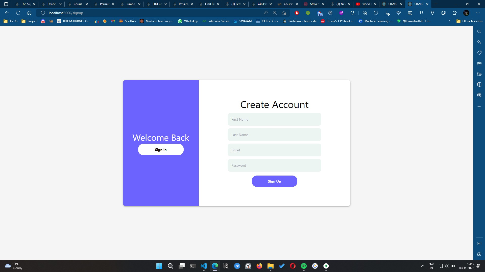

## Online Admission Management System

### **USER SIDE**

### **Objective**

This system enables the students to fill application forms online and submit it. After submission three status are shown -

- Pending for approval
- Declined if admin declines it.
- Approved if admin approves it.

### **Features**

- JWT authorization is used for authentication
- MongoDB is used for storing all the data locally
- Express and NodeJS is used as a backend for server side
- React and Tailwind CSS is used for frontend
- React Router is used for routing all the requests
- JOI package is used for verifying data in forms
- Bcrypt is used for encrypting the password

### **Screenshots**

#### **Home page**

 

#### **Signup page**

 

#### **Login page**

 

#### **Portal Home page**

 

#### **Form page**

 

#### **Contact page**

 

#### **Error page**

 

#### **Database side**

- Registration info

- Form info
  
